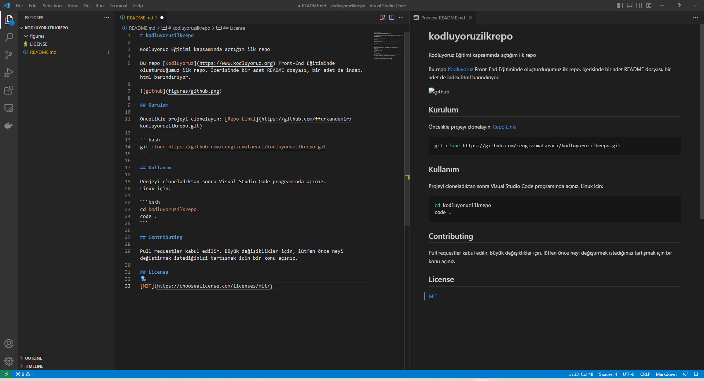

# kodluyoruzilkrepo

Kodluyoruz Eğitimi kapsamında açtığım ilk repo

Bu repo [Kodluyoruz](https://www.kodluyoruz.org) Front-End Eğitiminde oluşturduğumuz ilk repo. İçerisinde bir adet README dosyası, bir adet de index.html barındırıyor.



## Kurulum

Öncelikle projeyi clonelayın: [Repo Linki](https://github.com/ffurkandemir/kodluyoruzilkrepo.git)

```bash
git clone https://github.com/cengizcmataraci/kodluyoruzilkrepo.git
```

## Kullanım

Projeyi cloneladıktan sonra Visual Studio Code programında açınız.
Linux için:

```bash
cd kodluyoruzilkrepo
code .
```

## Contributing

Pull requestler kabul edilir. Büyük değişiklikler için, lütfen önce neyi değiştirmek istediğinizi tartışmak için bir konu açınız.

## License

[MIT](https://choosealicense.com/licenses/mit/)